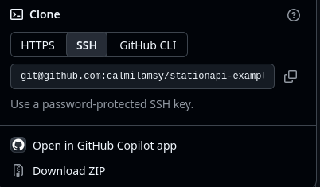
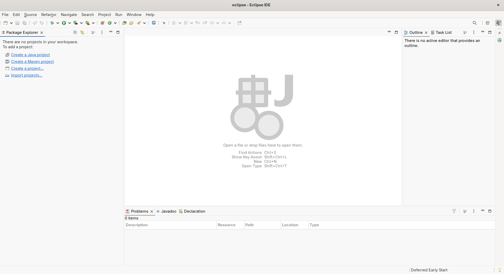

In this tutorial, you will learn how to clone the StationAPI example mod and set it up with your IDE (integrated development environment) of choice.

Out of the box, Fabric Loom supports [IntelliJ](https://www.jetbrains.com/idea/), [Eclipse](https://eclipseide.org/), and [Visual Studio Code](https://code.visualstudio.com/). Other IDEs may be used but may require additional setup steps.

## Clone stationapi-example-mod
The [stationapi-example-mod](https://github.com/calmilamsy/stationapi-example-mod) is a templated GitHub repository that allows users to clone
or download and setup in a few easy steps.

If you would like to clone the repository to your account, you can click on the "Use this template button" seen below:


After pressing on this, GitHub will allow you to clone this to a specific organization or user on your GitHub account.

Next, press the "Code" button pictured below:


GitHub allows users to authenticate in one of two ways: SSH and HTTPS. SSH is the preferred method for securely committing
to GitHub. If your account uses SSH, press on the SSH button and hit the copy link button. The process is the same for HTTPS.


If you are using [Git](https://git-scm.com/) from the terminal, you may enter the following:
```bash
# SSH
git clone git@github.com:calmilamsy/stationapi-example-mod.git

# HTTPS
git clone https://github.com/calmilamsy/stationapi-example-mod.git
```
Replace the link above with the repository you generated.

If you do not wish to use GitHub or would like to do it at a later time, you may press on the "Download ZIP" button 
pictured above to obtain a copy of the `stationapi-example-mod`. 

## Setup Java

StationAPI requires a JVM (Java Virtual Machine) that supports Java 17 or higher. The current Java LTS is Java 25 which is **required** for modern Fabric Loom
to build and run the example mod. Depending on the OS/distro you are using, the installation instructions differ and there are many vendors
who provide Java 25.

- [Eclipse Temurin](https://adoptium.net/temurin/)
- [Amazon Coretto](https://aws.amazon.com/corretto/)
- [Azul Zulu](https://www.azul.com/downloads/)
- [BellSoft Liberica](https://bell-sw.com/pages/downloads/)
- [Oracle](https://www.oracle.com/java/)

There should be little to no functional differences in the JVMs produced by these vendors. I personally prefer to use the top 3 over the others.
Oracle specifically requires an account to download the latest Java.

If on Windows, prefer the `MSI`/`EXE` over a `ZIP` file as it must be installed manually. Make sure to select "All Features" when installing to ensure
that the installer sets the latest JVM as the default in the registry.

If on Linux, prefer your distro's package manager over the `ZIP` file for the same reason as above.

If on M-series architecture (macOS), make sure to select AARCH64 `DMG`/`ZIP` over x86_64 as x86_64 requires an emulation layer called [Rosetta](https://en.wikipedia.org/wiki/Rosetta_(software)) which may significantly decrease performance.

## Setup IDE

### IntelliJ
For IntellIJ, use the "Open Project" button on the main window or click on the File menu and click on "Open Project" 
if you are already in a project.

Make sure to select the `build.gradle.kts` or `settings.gradle.kts`. Click on "Open as project" instead of "Open as file".

IntelliJ will automatically load Gradle and any dependencies required by the example mod.

The [Minecraft Development Plugin](https://plugins.jetbrains.com/plugin/8327-minecraft-development) is recommended for developing Minecraft
mods and plugins. It also helps with auto-complete for Mixins which are commonly used in Fabric environments.

See [Final Steps](#final-steps) to finish importing the project.

### Eclipse
The first step in working with Eclipse is to set up a workspace which is where all of your projects will be loaded into.

If you do not already have a workspace setup, Eclipse will ask you on startup where you would like to keep your workspace. I recommend
keeping a workspace for each type of Java project you create (e.g. Fabric, MCP, etc). Place it in a folder that you can easily access such as your
Documents folder. It is extremely important that you do not place your project in a directory controlled by OneDrive (if on Windows) as it will extremely
impact performance negatively.

After doing so, you should be greeted with the following screen on an empty workspace:


Press on the "Import projects", click on the Gradle wizard and then click on "Existing Gradle project" and press the "Next" button.
In the Project root directory field, press the Browse button and locate the folder where you cloned the `stationapi-example-mod` into.

You may now press the "Finish" button. If you would like to alter the Gradle distribution used (e.g. to point to a locally installed Gradle build), press Next and configure it there.

See [Final Steps](#final-steps) to finish importing the project.

### Visual Studio Code

After installing Visual Studio Code, you will need to install a few plugins to be able to mod your game.

The bare minimum extensions are:
- Gradle for Java
- Language Support for Java(TM) by Red Hat

I recommend installing Extension Pack for Java which includes this and more extensions to aid in the development of Java projects.

See [Final Steps](#final-steps) to finish importing the project.

### Setting up without an IDE
Using an IDE is **HIGHLY** recommended because of all the useful development features they give to the user however it is 
still possible to use a simple text editor like Notepad and the terminal to build and create a mod.

See [Final Steps](#final-steps) to import the project.
After doing so, you may edit the Java files manually using a text editor. If you would like to run the game, use the following command:
```bash
gradlew runClient # or runServer for server
```

### Final Steps

The Gradle project must be manually completed inside the terminal (with or without IDE) by running the following command:
```bash
gradlew _setup/setupMod # Windows CMD

.\gradlew.bat _setup/setupMod # Windows Powershell

./gradlew _setup/setupMod # macOS/Linux
```

In this tutorial, you will have learned how to setup the `stationapi-example-mod` and how to import it into the IDE of your choice.

See [Project Structure](./Project-Structure) for an explanation on how the project is structured.